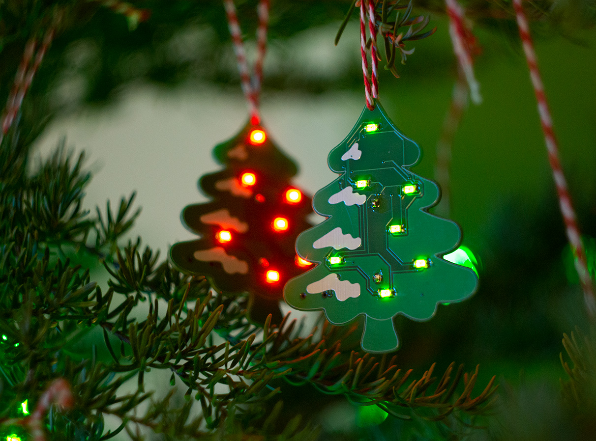
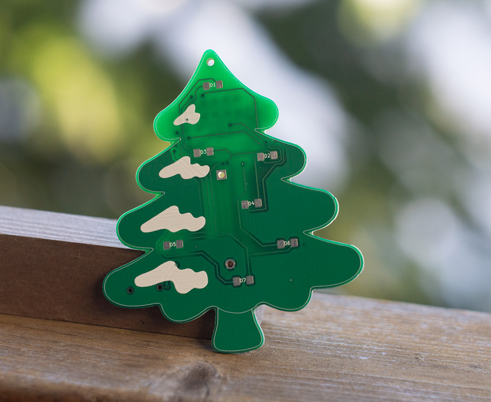
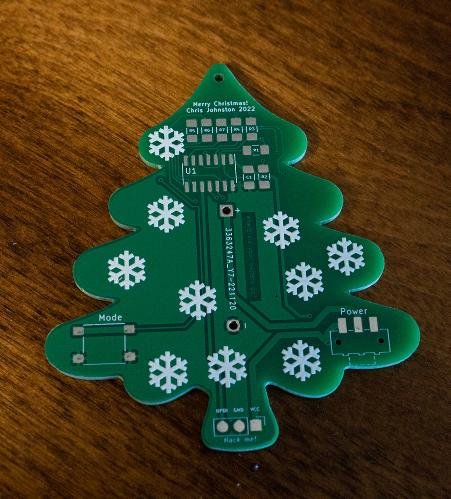
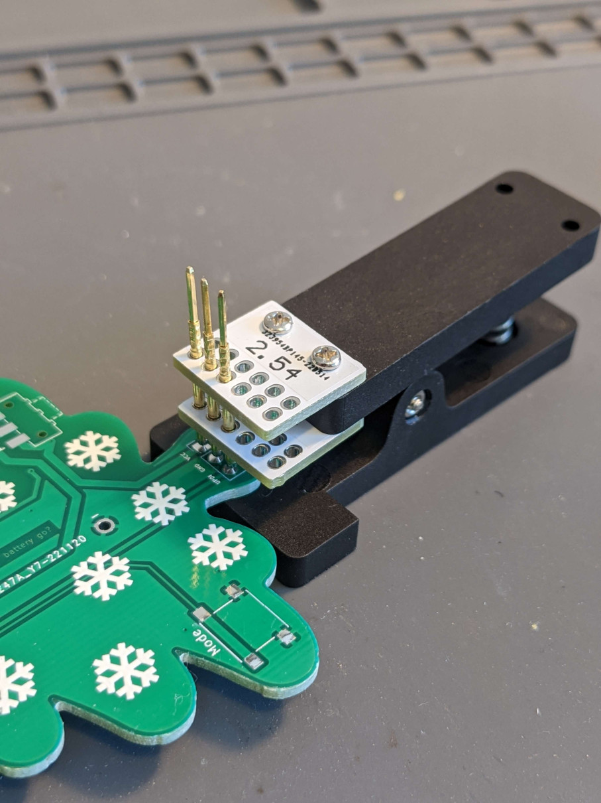

# Xmas Ornament 2022

An ATTiny404 LED Xmas tree ornament. I made a bunch of these as gifts.

## The board

## Resources used

- [svg2mod] was used to generate the footprint of the board, and the front silkscreen layer
  - The Tree Emoji [u1f332] SVG was modified so I could create a footprint from it.
- I referred to [SerialUPDI] to figure out UPDI, but made my own board for adapting between FTDI and UPDI (and left a typo in the name, oops)
- [megaTinyCore] was used with Arduino (via the vscode Arduino extension) to upload to the ATTiny404

[svg2mod]: https://github.com/svg2mod/svg2mod
[u1f332]: https://commons.wikimedia.org/wiki/File:Emoji_u1f332.svg
[SerialUPDI]: https://teddywarner.org/Projects/SerialUPDI/
[megaTinyCore]: https://github.com/SpenceKonde/megaTinyCore

## Bill of Materials

| Reference | Description |
| --------- | ----------- |
| PCB | $0.43 (+ $0.40 shipping) per PCB |
| C1 | 1 uf 1206 capacitor |
| D1 - D7 | 1206 Bidirectional Red/Green LED |
| R1 - R7 | 1206 50 ohm resistor |
| SW1 | 6x6mm Pushbutton |
| SW2 | JS102011SAQN Slide Switch |
| U1 | Attiny404-SS |
| B1 | CR2023 Battery Holder |

## Changes from last year's version

In 2021 I made the [snowflake-ornament], which was a different design that ran on the ATTiny85.
This year I wanted something with a bit more I/O, and it also helps that the ATTiny404 was almost a whole $1 cheaper per unit than the ATTiny85.

Since I had more I/O, I could also fit more LEDs on the board. Instead of only 6 LEDs from last year,
this year's design has 7 bi-directional red/green LEDs. (The ATTiny404 has 6 PWM pins, I wanted PWM on each LED but the design looked weird with only 6.)

One downside of this is that I couldn't use the same programming interfaces that I've used for other boards, but I made my own FTDI to UPDI adapter to handle it.

To connect to the board, instead of leaving an unpopulated programming header, I left some test points and used a spring-loaded pogo pin jig:

Another important change from last year was to use 1206 components everywhere. Last year I used 0603 LEDs, the bigger components were much easier to assemble.

Last year I spent a lot of time optimizing the ornament to run in deep sleep mode when not in use, so I could just use a single button to power it on and change patterns. That was a lot of work, and by the next year the batteries would be dead. This year, I instead just used an on/off switch.

[snowflake-ornament]: https://github.com/Chris-Johnston/snowflake-ornament